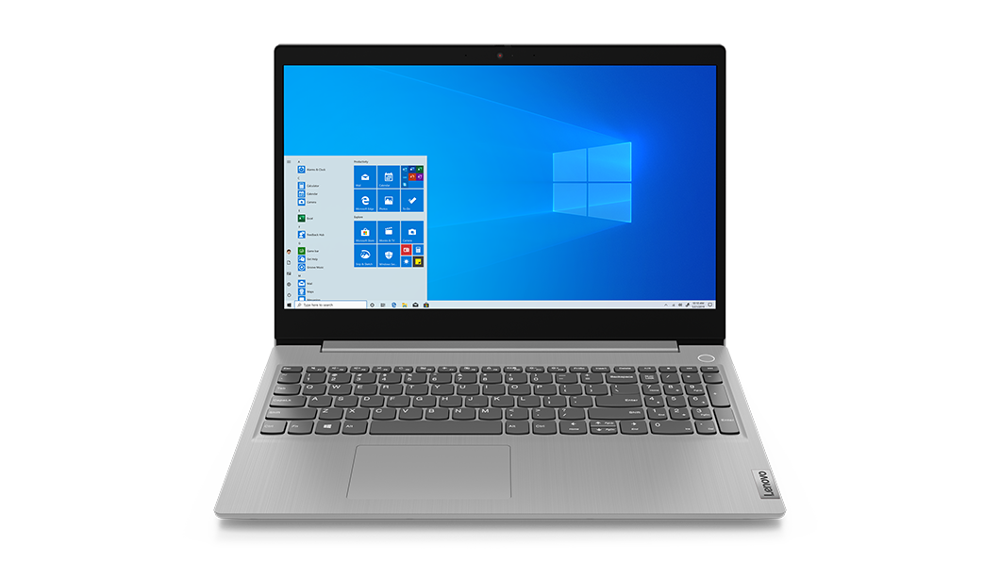
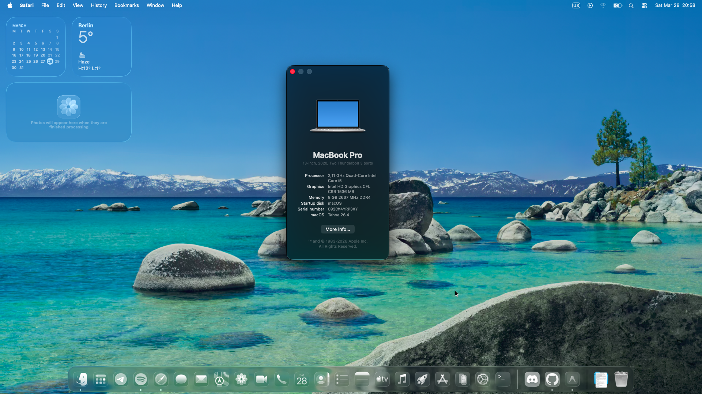
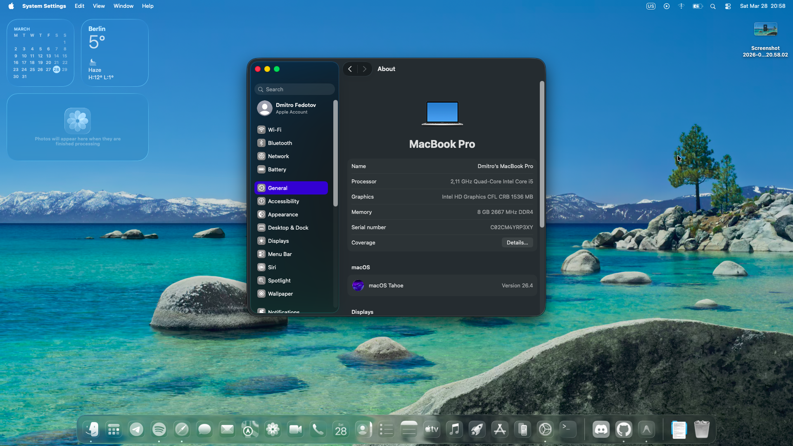
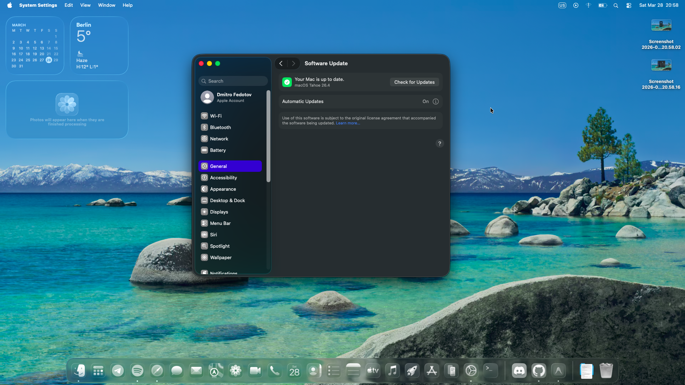

# EFI for Hackintosh on Lenovo Ideapad 3 15iml05

## Fully working EFI.
It should work, if you get issues, just do report it in issues and I will fix it.

## Native WiFi Patching Config Part is also there! Just need to uncomment it in DeviceProperties tab.

  

## Specifications

| Component | Model | Status |
|---|---|---|
| CPU | Intel Core i5-10210U | Up to macOS Tahoe 26 |
| iGPU | Intel Integrated Graphics(630) | Up to macOS Tahoe 26 |
| Audio | Realtek Audio | Up to macOS Tahoe 26 |
| Wi-Fi | Intel Wi-Fi 6E AX210 | Up to macOS Tahoe 26 |
| Bluetooth | Intel Bluetooth | Up to macOS Tahoe 26 |
| Storage | NVMe SSD | Up to macOS Tahoe 26 |

## What Works
- Everything except:
  
## What Doesn't Work

- Native WiFi support(!!SINCE SEQUOIA!!)
- Sound(!!ONLY IF YOU ARE ON MACOS TAHOE, PATCHING REQUIRED!!)

## BIOS Settings

- Disable Secure Boot
- Disable Fast Boot

## Screenshots

  

  

  

## Credits
- Hackintosh community for finding and helping to fix my errors which were not leading to boot, and also for Mmio Whitelists.
